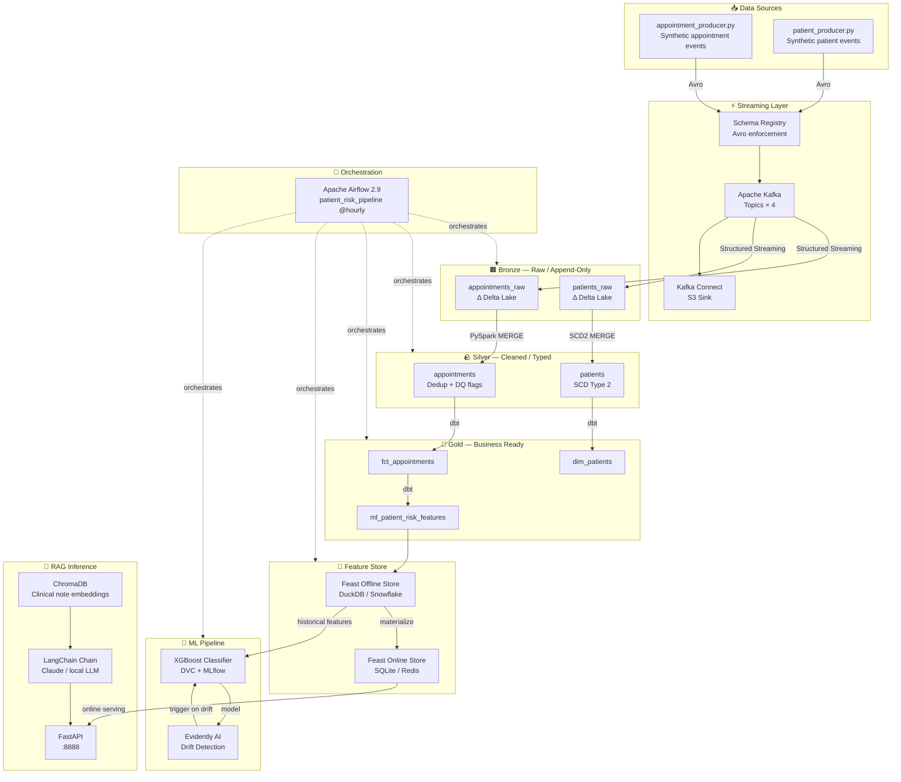
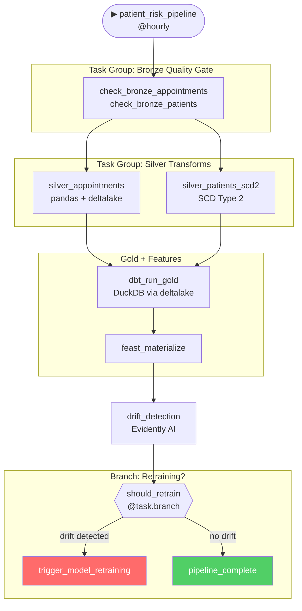
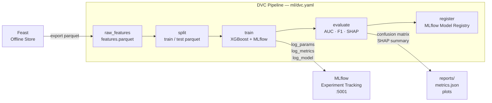
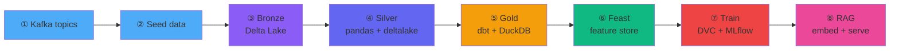
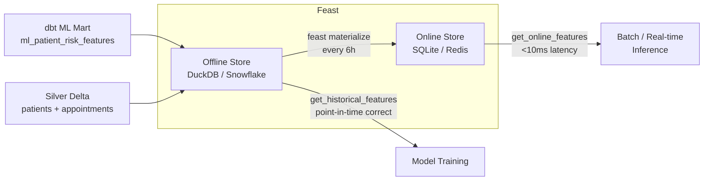
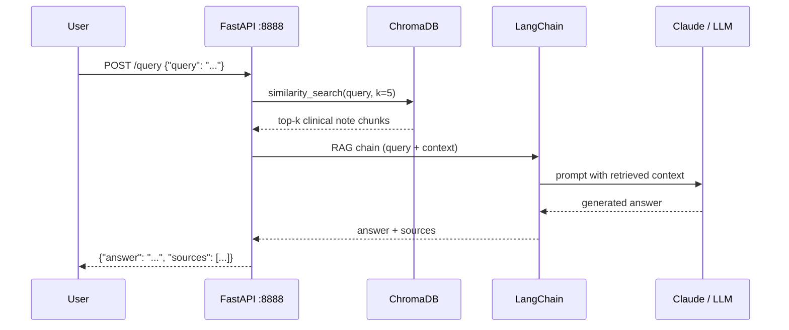
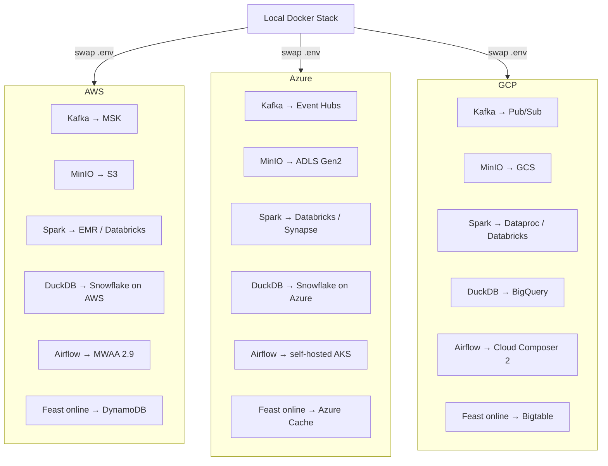
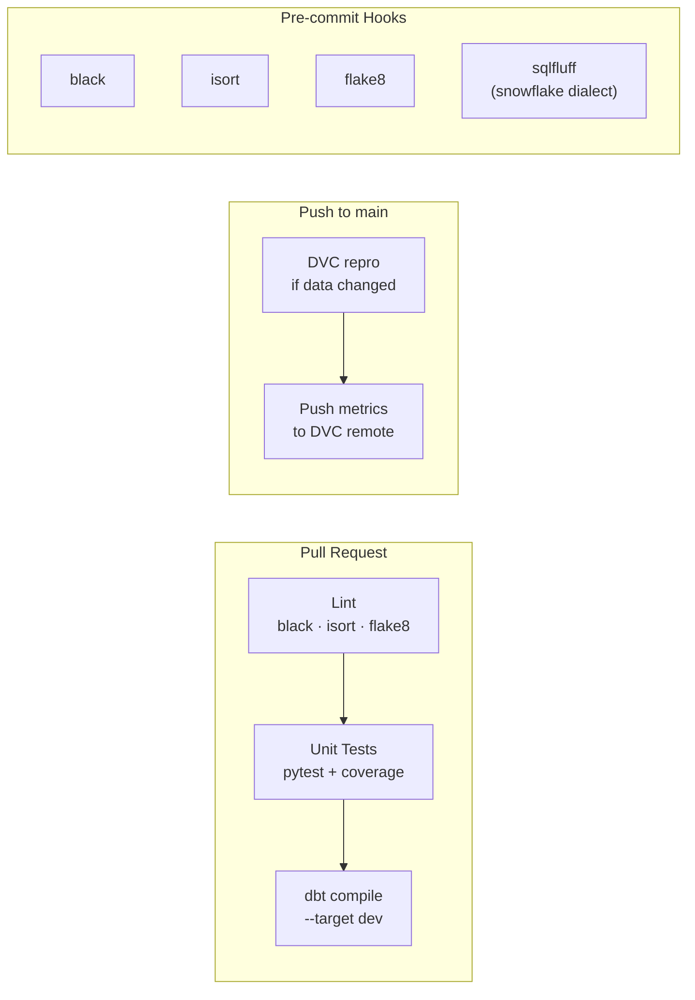

# healthcare-ml-platform

> **End-to-end healthcare ML data platform** — streaming ingestion through feature serving and RAG inference, built with the modern data lakehouse stack.

[](https://www.python.org/)
[](https://airflow.apache.org/)
[](https://delta.io/)
[](https://www.getdbt.com/)
[](LICENSE)

A **production-grade ML data platform** for predicting patient appointment no-shows. Demonstrates streaming ingestion, medallion architecture, distributed Spark processing, SQL transformation with dbt, feature engineering with Feast, model training with DVC + MLflow, and a RAG inference endpoint — all orchestrated via Airflow and running locally for **$0**.

---

## Table of Contents

1. [Architecture](#architecture)
2. [Tech Stack](#tech-stack)
3. [Repository Structure](#repository-structure)
4. [Quick Start](#quick-start)
5. [Running the Pipeline End-to-End](#running-the-pipeline-end-to-end)
6. [Component Deep Dives](#component-deep-dives)
7. [Testing](#testing)
8. [Cloud Deployment](#cloud-deployment)
9. [CI/CD](#cicd)

---

## Architecture

### System Overview



### Medallion Layer Flow

```mermaid
flowchart LR
    K["Kafka\nEvent Stream"]

    subgraph BZ["🟫 BRONZE"]
        direction TB
        BA["appointments_raw"]
        BP["patients_raw"]
    end

    subgraph SV["🪨 SILVER"]
        direction TB
        SA["appointments\n• Dedup\n• Type cast\n• DQ flag"]
        SP["patients\n• SCD Type 2\n• valid_from/to\n• is_current"]
    end

    subgraph GD["🥇 GOLD  (dbt)"]
        direction TB
        GF["fct_appointments"]
        GD2["dim_patients"]
        GM["ml_patient_risk_features\n• no_show_rate_30d/90d\n• avg_lead_time\n• provider_rate"]
    end

    K -->|"Spark Streaming\n60s micro-batch"| BZ
    BZ -->|"PySpark batch\nAirflow-triggered"| SV
    SV -->|"dbt run\nDuckDB / Snowflake"| GD
    GD -->|"feast materialize"| FS["Feast\nFeature Store"]
    FS -->|"point-in-time\nhistorical features"| ML["XGBoost\nModel Training"]
```



### Airflow DAG — Master Pipeline



### ML Pipeline — DVC Stages



---

## Tech Stack

| Layer | Tool | Local | Cloud Equivalent |
|---|---|---|---|
| **Streaming** | Apache Kafka 3.7 | Docker | AWS MSK / Azure Event Hubs / Confluent Cloud |
| **Schema Registry** | Confluent Schema Registry | Docker | Confluent Cloud / AWS Glue SR |
| **Object Storage** | MinIO | Docker | AWS S3 / Azure ADLS Gen2 / GCS |
| **Lakehouse Format** | Delta Lake 3.1 | Local PySpark | Databricks / AWS EMR / Azure Synapse |
| **Batch Processing** | PySpark 3.5 | Spark standalone | Databricks / AWS EMR / GCP Dataproc |
| **SQL Transform** | dbt Core 1.11 | DuckDB (free) | Snowflake / BigQuery / Redshift |
| **Orchestration** | Airflow 2.9 | Docker (Celery) | AWS MWAA / GCP Cloud Composer |
| **Feature Store** | Feast 0.40 | SQLite + DuckDB | Tecton / AWS SageMaker FS |
| **Data Versioning** | DVC 3.x | Local | DVC + S3 remote |
| **Experiment Tracking** | MLflow 2.13 | Docker | Databricks MLflow / Azure ML |
| **ML Model** | XGBoost + SHAP | Local | SageMaker / Vertex AI / AzureML |
| **Drift Monitoring** | Evidently AI | Local | Evidently Cloud / Arize |
| **Vector Store** | ChromaDB 0.5 | Docker | Pinecone / Weaviate / OpenSearch |
| **RAG Framework** | LangChain 0.2 | Local | Bedrock / Azure OpenAI |
| **Inference API** | FastAPI 0.111 | Local | AWS Lambda / Cloud Run / AKS |
| **Data Quality** | Great Expectations | Local | GX Cloud |
| **CI/CD** | GitHub Actions | — | — |

> **Total infrastructure cost: $0** — all tools are open-source or have free tiers.

---

## Repository Structure

```
healthcare-ml-platform/
├── docker-compose.yml              # Full local stack (14 services)
├── Makefile                        # 30+ dev shortcuts
├── pyproject.toml                  # Python deps + tool config
├── .env.example                    # All environment variables documented
│
├── ingestion/                      # ① Kafka producers + schemas
│   ├── schemas/
│   │   ├── appointment_event.avsc  # Avro schema — appointment lifecycle
│   │   └── patient_event.avsc      # Avro schema — patient registration
│   ├── producers/
│   │   ├── appointment_producer.py # Synthetic appointment events → Kafka
│   │   └── patient_producer.py     # Synthetic patient events → Kafka
│   ├── consumers/
│   │   ├── delta_sink.py           # Kafka → Delta Lake bronze (PySpark — production)
│   │   └── delta_sink_simple.py    # Kafka → Delta Lake bronze (pandas/deltalake — local dev)
│   └── seed_bronze.py              # Direct bronze seeding — bypasses Kafka for quick local setup
│
├── pipelines/
│   ├── spark/                      # ② ③ PySpark medallion jobs
│   │   ├── bronze/
│   │   │   └── ingest_appointments.py
│   │   ├── silver/
│   │   │   ├── clean_appointments.py   # Dedup + cast + DQ flag
│   │   │   └── scd2_patients.py        # SCD Type 2 patient dimension
│   │   └── gold/
│   │       └── patient_risk_features.py
│   └── dbt/                        # ④ SQL transformations
│       ├── models/staging/         # 1:1 source casts
│       ├── models/intermediate/    # Business logic joins
│       └── models/marts/           # Core dims/facts + ML feature mart
│
├── orchestration/dags/             # ⑥ Airflow DAGs
│   ├── patient_risk_pipeline.py    # Master hourly DAG
│   ├── dbt_daily_refresh.py
│   ├── model_retraining.py
│   └── feast_materialization.py
│
├── feature_store/feature_repo/     # ⑤ Feast definitions
│   ├── feature_store.yaml
│   ├── entities.py
│   ├── feature_views.py            # 3 feature views, 13 features
│   └── feature_services.py
│
├── ml/                             # ⑦ DVC + MLflow
│   ├── dvc.yaml                    # Pipeline stages
│   ├── params.yaml                 # Versioned hyperparameters
│   ├── train.py                    # XGBoost + MLflow logging
│   ├── evaluate.py                 # Metrics, SHAP, confusion matrix
│   └── drift_detection.py          # Evidently AI reports
│
├── rag/                            # ⑨ ChromaDB + LangChain
│   ├── embed_notes.py              # Embed clinical notes → ChromaDB
│   ├── retriever.py                # Semantic search
│   ├── chain.py                    # LangChain RAG chain
│   └── api/
│       ├── main.py                 # FastAPI app
│       └── schemas.py              # Pydantic models
│
├── quality/expectations/           # ⑩ Great Expectations suites
├── infra/
│   ├── postgres/init-multiple-dbs.sh
│   ├── terraform/aws/
│   ├── terraform/azure/
│   ├── terraform/gcp/
│   └── snowflake/setup.sql
└── .github/workflows/
    ├── ci.yml                      # PR: lint + unit tests + dbt compile
    └── dvc_repro.yml               # DVC pipeline on data change
```

---

## Quick Start

### Prerequisites

```bash
docker >= 24.0
docker compose >= 2.24
python >= 3.11
# java >= 11 only needed if running PySpark jobs directly (optional for local dev)
```

### 1. Clone and configure

```bash
git clone https://github.com/YOUR_USERNAME/healthcare-ml-platform.git
cd healthcare-ml-platform
make env            # Copies .env.example → .env
```

### 2. Start the full stack

```bash
make up
```

Starts Docker services. On first launch, Airflow workers install additional Python packages via `_PIP_ADDITIONAL_REQUIREMENTS` — wait **5–10 minutes** before triggering DAGs.

| Service | URL | Credentials |
|---|---|---|
| **Airflow UI** | http://localhost:8088 | admin / admin |
| **Kafka UI** | http://localhost:8080 | — |
| **MinIO Console** | http://localhost:9001 | minioadmin / minioadmin |
| **Spark Master UI** | http://localhost:8082 | — |
| **MLflow** | http://localhost:5001 | — |
| **ChromaDB** | http://localhost:8000 | — |
| **Schema Registry** | http://localhost:8081 | — |

### 3. Set up Python environment

```bash
python -m venv .venv && source .venv/bin/activate
pip install -e ".[dev]"
```

---

## Running the Pipeline End-to-End



### Step 1 — Seed bronze data

Two paths depending on how much local setup you want:

**Path A — Direct seeding (fastest, no Kafka dependency):**
```bash
make seed-bronze    # Writes 2000 appointments + 500 patients directly to Delta Lake
```

**Path B — Full Kafka streaming (demonstrates the streaming architecture):**
```bash
make kafka-topics   # Create dev.healthcare.appointment.scheduled + patient.registered
make seed-once      # Produce 500 appointment + 200 patient Avro events to Kafka
make kafka-sink     # Consume from Kafka → write to Delta Lake bronze
```

Verify data landed in **MinIO Console** at http://localhost:9001 → `healthcare/bronze/`.

> **Note:** The Kafka producers require `confluent-kafka fastavro faker` to be installed in the airflow-worker. On first run after `make up`, these are installed automatically via `_PIP_ADDITIONAL_REQUIREMENTS`. `kafka-connect` (the managed connector service) is also available but memory-intensive — the `delta_sink_simple.py` consumer is the recommended local alternative.

---

### Step 2 — Trigger the Airflow DAG

The `patient_risk_pipeline` DAG orchestrates all remaining steps automatically:

1. Open **Airflow UI** at http://localhost:8088 (admin / admin)
2. Enable the `patient_risk_pipeline` DAG (toggle on the DAGs list)
3. Click **Trigger DAG ▶**
4. Watch tasks run in the **Graph View**

The DAG runs the following tasks in sequence:

| Task Group | Tasks | What Happens |
|---|---|---|
| `bronze_quality` | `check_bronze_appointments`, `check_bronze_patients` | Great Expectations validates bronze Delta tables |
| `silver_transforms` | `silver_appointments`, `silver_patients_scd2` | Dedup, type-cast, derive features, SCD2 — pandas + deltalake |
| — | `dbt_run_gold` | Loads silver → DuckDB, runs dbt staging + ML mart models |
| — | `feast_materialize` | Materializes features to online store (skips gracefully if feast not configured) |
| — | `drift_detection` | Evidently drift report vs. reference dataset (skips if no reference) |
| — | `should_retrain` | Branches: triggers `model_retraining` DAG on drift, else `pipeline_complete` |

**Total runtime: ~60 seconds on a laptop.**

---

### Step 3 — Gold layer (standalone dbt)

To run dbt independently of Airflow:

```bash
make dbt-run       # Build all models against DuckDB
make dbt-test      # Run not_null, unique, and accepted_values tests
make dbt-docs      # Serve lineage docs at http://localhost:8085
```

dbt uses DuckDB for local dev and Snowflake for prod — switch with `DBT_TARGET=prod dbt run`.

---

### Step 4 — Feature store (Feast)

```bash
make feast-apply        # Register entities + feature views
make feast-materialize  # Backfill last 30 days into online store
```

Three feature views are registered:

| Feature View | Key Features |
|---|---|
| `patient_appointment_stats` | `no_show_rate_30d`, `no_show_rate_90d`, `avg_lead_time_days` |
| `patient_demographics` | `age_at_appointment`, `insurance_type`, `distance_to_clinic_miles` |
| `appointment_context` | `appointment_type`, `day_of_week`, `hour_of_day`, `is_reminder_sent` |

---

### Step 5 — Train the model

```bash
make dvc-repro      # Runs: raw_features → split → train → evaluate → register
make dvc-metrics    # Show ROC-AUC, F1, precision/recall
```

Track all experiments at **MLflow** → http://localhost:5001.

---

### Step 6 — RAG inference endpoint

```bash
make rag-embed      # Embed synthetic clinical notes into ChromaDB
make rag-start      # FastAPI at http://localhost:8888
```

```bash
curl -X POST http://localhost:8888/query \
  -H "Content-Type: application/json" \
  -d '{"query": "Which Medicare patients are most likely to no-show for follow-ups?"}'
```

Interactive docs at http://localhost:8888/docs.

---

## Component Deep Dives

### Streaming Ingestion — Kafka

**Files:** [ingestion/producers/](ingestion/producers/), [ingestion/schemas/](ingestion/schemas/), [ingestion/consumers/](ingestion/consumers/)

Avro schemas define strict contracts enforced by Schema Registry (auto-registered on first producer run):
- `AppointmentEvent` — 17 typed fields covering the full lifecycle (SCHEDULED → NO_SHOW)
- `PatientEvent` — demographics, insurance, communication preferences

**Topics:** `dev.healthcare.appointment.scheduled`, `dev.healthcare.patient.registered` (3 partitions, RF=1)

**Producer design:**
- `acks='all'` + `enable.idempotence=True` — exactly-once semantics
- `compression.type='snappy'` — ~40% payload size reduction
- `linger.ms=50` — throughput batching without sacrificing latency

**Two Delta sink options:**

| File | Runtime | Use case |
|---|---|---|
| `delta_sink.py` | PySpark | Production — Databricks / EMR / Spark standalone |
| `delta_sink_simple.py` | Python (confluent_kafka + deltalake) | Local dev — no Java/Spark required |

Both commit Kafka offsets only *after* a successful Delta write — no data loss on failure. Run via `make kafka-sink`.

---

### Delta Lake Bronze Layer

**Files:** [pipelines/spark/bronze/ingest_appointments.py](pipelines/spark/bronze/ingest_appointments.py)

Append-only and immutable — raw events land here exactly as received from Kafka.

```python
df.writeStream.format("delta")
  .outputMode("append")
  .option("checkpointLocation", CHECKPOINT_PATH)
  .partitionBy("_partition_date")
  .trigger(processingTime="60 seconds")
  .start(BRONZE_PATH)
```

Confluent wire format (5-byte prefix) is stripped before Avro deserialization:
```python
F.expr("substring(value, 6, length(value) - 5)")
```

Delta table properties: `optimizeWrite`, `autoCompact`, `mergeSchema=true`.

---

### Silver Transforms

**Airflow tasks:** `silver_transforms.silver_appointments`, `silver_transforms.silver_patients_scd2`
**Local implementation:** pandas + deltalake (no Spark/Java dependency)
**Production equivalent:** [pipelines/spark/silver/](pipelines/spark/silver/) — PySpark jobs for Databricks/EMR

The Airflow tasks apply these transformations in Python:

```python
# Deduplicate: keep latest event per appointment_id
df = df.sort_values("event_timestamp", ascending=False).drop_duplicates("appointment_id")

# Derive typed columns (epoch-ms → UTC datetime strings for DuckDB ::timestamp cast)
sched_dt = pd.to_datetime(df["scheduled_start_ts"], unit="ms", utc=True).dt.tz_convert(None)
df["scheduled_start_ts"] = sched_dt.astype(str)
df["is_cancelled"]        = df["event_type"] == "CANCELLED"
df["is_morning_appointment"] = sched_dt.dt.hour < 12
df["scheduled_day_of_week"]  = sched_dt.dt.dayofweek.astype("int32")
df["lead_time_category"]     = df["lead_time_hours"].apply(_lead_time_cat)  # SAME_DAY/SHORT/MEDIUM/LONG
```

Written to Silver Delta with `schema_mode="overwrite"` to handle schema evolution across runs.

**SCD Type 2** on the patient dimension tracks every insurance/demographic change:

| Column | Purpose |
|---|---|
| `valid_from` | UTC timestamp this version became active |
| `valid_to` | Empty string for the current row; set to next event timestamp on expiry |
| `is_current` | Boolean — exactly one `True` per `patient_id` |
| `date_of_birth_date` | Converted from epoch-days integer to ISO date string |

---

### dbt Gold Layer

**Files:** [pipelines/dbt/](pipelines/dbt/)
**Target (local):** DuckDB — silver Delta tables are loaded into DuckDB by the `dbt_run_gold` Airflow task before dbt runs
**Target (prod):** Snowflake — set `DBT_TARGET=prod`

Two-layer model structure (local dev):

```
staging/   → 1:1 with Silver. Type casts, renames, boolean derivations.
marts/
  ml/      → ml_patient_appointment_stats — point-in-time correct rolling window features
```

Every model has a `.yml` file with `not_null` + `unique` tests on the primary key. The ML feature mart computes rolling statistics with DuckDB range-frame window functions (no data leakage — each appointment only sees prior appointments):

| Feature | Window | Type |
|---|---|---|
| `no_show_rate_30d` | 30 days | float |
| `cancellation_rate_30d` | 30 days | float |
| `no_show_rate_90d` | 90 days | float |
| `cancellation_rate_90d` | 90 days | float |
| `total_appointments_90d` | 90 days | int |
| `avg_lead_time_days` | 90 days | float |
| `last_appointment_days_ago` | — | int |

---

### Feast Feature Store

**Files:** [feature_store/feature_repo/](feature_store/feature_repo/)



---

### DVC + MLflow ML Pipeline

**Files:** [ml/](ml/)

Versioned hyperparameters in [ml/params.yaml](ml/params.yaml):

```yaml
model:
  n_estimators: 200
  max_depth: 6
  learning_rate: 0.05
  scale_pos_weight: 3.5   # class imbalance — no-shows are ~15% of appointments
  subsample: 0.8
split:
  test_size: 0.2
  random_state: 42
```

```bash
dvc repro           # Full pipeline — only re-runs changed stages
dvc params diff     # Compare params to last commit
dvc metrics show    # ROC-AUC, F1, precision, recall
```

---

### ChromaDB RAG Endpoint

**Files:** [rag/](rag/)



**Embeddings:** `sentence-transformers/all-MiniLM-L6-v2` — runs fully locally, no API key required.

**API endpoints:**

| Method | Path | Description |
|---|---|---|
| `GET` | `/health` | Health check |
| `POST` | `/query` | Free-text RAG query |
| `GET` | `/patient/{patient_id}/risk` | Risk summary for a patient |
| `POST` | `/embed` | Embed new clinical notes |

---

### Data Quality — Great Expectations

**Files:** [quality/expectations/](quality/expectations/)

GX suites gate each medallion layer transition as Airflow tasks:

| Suite | Key Expectations |
|---|---|
| `bronze_appointments` | Row count ≥ 1, columns exist, no nulls on key fields, `event_type` in `[SCHEDULED, RESCHEDULED, CANCELLED, COMPLETED, NO_SHOW]`, `event_id` unique |
| `bronze_patients` | Row count ≥ 1, `event_id` unique, `insurance_type` in valid set, `distance_to_clinic_miles` in [0, 500] |
| `silver_appointments` | No nulls on key fields, `scheduled_date` valid, `is_no_show` not null |
| `gold_features` | `no_show_rate_30d`/`90d` in [0.0, 1.0], `day_of_week` in [0–6], `hour_of_day` in [0–23] |

Suites validate DataFrames loaded directly from Delta Lake via the `deltalake` library (PandasExecutionEngine), allowing GX checkpoints to run inside Airflow without any S3/Spark dependency.

---

## Testing

```bash
make test               # pytest unit tests with coverage report
make test-integration   # Integration tests (requires stack running)
make lint               # black + isort + flake8
make dbt-test           # dbt schema + singular tests
make gx-run             # Great Expectations checkpoints
```

### Test structure

```
tests/
├── unit/
│   ├── test_spark_transforms.py    # chispa DataFrame equality assertions
│   ├── test_feature_logic.py       # Feature computation unit tests
│   └── test_dbt_macros.py          # dbt macro tests
└── integration/
    ├── test_kafka_pipeline.py       # End-to-end Kafka → Delta
    ├── test_feast_materialize.py    # Offline → online store
    └── test_rag_endpoint.py         # FastAPI integration
```

---

## Cloud Deployment

The local stack maps 1:1 to cloud services. Switch targets by updating `.env`.



Terraform modules for each cloud are in [infra/terraform/](infra/terraform/).

---

## CI/CD



Install pre-commit hooks locally:
```bash
make pre-commit
```

---

## Common Commands

```bash
# Stack
make up                          # Start all services
make down                        # Stop (preserve volumes)
make destroy                     # Stop + delete volumes
make logs service=airflow-scheduler

# Seeding — two paths
make seed-bronze                 # Fast: write 2 000 rows directly to Delta Lake (recommended)
make kafka-topics                # Create Kafka topics, then:
make seed-once                   # Produce 500 appointment + 200 patient Kafka events
make kafka-sink                  # Consume all Kafka messages → Delta Lake bronze

# dbt
make dbt-run                     # dbt run --target dev
make dbt-test                    # dbt test
make dbt-docs                    # Serve docs at :8085

# Feast
make feast-apply
make feast-materialize

# ML
make dvc-repro                   # Full pipeline
make dvc-metrics
make train                       # Direct (no DVC)

# RAG
make rag-embed
make rag-start                   # FastAPI at :8888

# Tests
make test
make lint

# Spark (optional — submits to standalone Spark cluster)
make spark-submit job=bronze/ingest_appointments.py
```

---

*Built by Albert Lok · [LinkedIn](https://linkedin.com/in/albertlok) · [GitHub](https://github.com/albertlok)*
